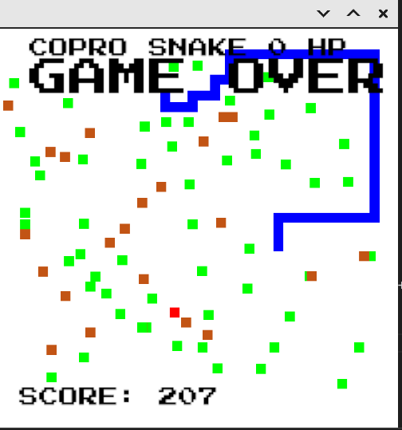

# COPRO-SNAKE game written in Rust

Rendering through **Piston** library with opengl backend.

## Build & run:

1. Install rust from https://www.rust-lang.org/tools/install
2. **"cargo build/run"** in project directory

## Control keys:

1. up/down/left/right -> movement
2. space -> spawn new snake

## Items on the screen:

1. Blue -> snake
2. Brown -> food for **growth**
3. Green -> **poison** -1 hp
4. Red -> **heal** + 1 hp